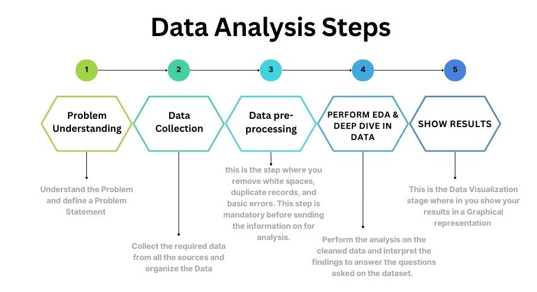

# Flipkart Laptops Analysis (EDA)
This ipython notebook is the <b>Exploratory data analysis (EDA)</b> of the <b>Laptops listed on Flipkart</b>. 
The dataset used has been compiled from first 40 product pages of Flipkart by web scrapping. 

## Packeges Used:
 ![Python][python] ![NumPy][numpy-image] ![Pandas][Pandas-image] ![Matplotlib][Matplotlib-image] ![Plotly][Plotly-image]  ![Jupyter Notebook][ipython-image]
 
[python]: https://img.shields.io/badge/python-3670A0?style=for-the-badge&logo=python&logoColor=ffdd54
[numpy-image]: https://img.shields.io/badge/numpy-%23013243.svg?style=for-the-badge&logo=numpy&logoColor=white
[Pandas-image]: https://img.shields.io/badge/pandas-%23150458.svg?style=for-the-badge&logo=pandas&logoColor=white
[Matplotlib-image]: https://img.shields.io/badge/Matplotlib-%23ffffff.svg?style=for-the-badge&logo=Matplotlib&logoColor=black
[Plotly-image]: https://img.shields.io/badge/Plotly-%233F4F75.svg?style=for-the-badge&logo=plotly&logoColor=white
[ipython-image]: https://img.shields.io/badge/jupyter-%23FA0F00.svg?style=for-the-badge&logo=jupyter&logoColor=white

# What is Exploratory Data Analysis?
Exploratory Data Analysis (EDA) is a technique used to gain insights and understanding from a given dataset. It is an approach for analyzing and summarizing data that allows analysts to identify patterns, trends, and relationships within the data. EDA is typically the first step in the data analysis process and also is an iterative process that involves visualizing and summarizing the data in various ways.  

Overall, EDA is a crucial step in the data analysis process, as it allows analysts to gain a deeper understanding of the data and identify any potential issues or limitations before proceeding with more advanced analysis. It also can also be a great way to find the insights that can guide the further analysis.

## The Task:
The task is to analyze the Flipkart Laptops data and answer some key questions like, most expensive laptop, cheapest laptop, laptop w.r.t. the brand, most expensive brand, search a laptop according to the keyword or specification and finally use this data to predict the price of laptop based on the features given.  

The the price prediction website is build using this same analysis. you can check the website at: <a href="https://huggingface.co/spaces/Shrikrishna/laptop_price_predictor">Laptop Price Predictor</a> 

## Process:

## About Data:
This dataset consist of details of all the laptops models(SKUs) listed on the Flipkart website. Details like Name, brand, selling price, MRP, discount, ratings, rating count, details, etc.
This data is scraped from the first 40 pages of flipkart.com website for the search keyword laptop.  
There is no Null Values and duplicates in the dataset. There are 8 columns and 404 rows in the dataset.  
The columns are as follows:  
    - Name ( name of the product)  
    - Brand ( Brand)  
    - Selling Price  
    - MRP  
    - Discount  
    - ratings  
    - no_of_ratings  
    - Details
    
